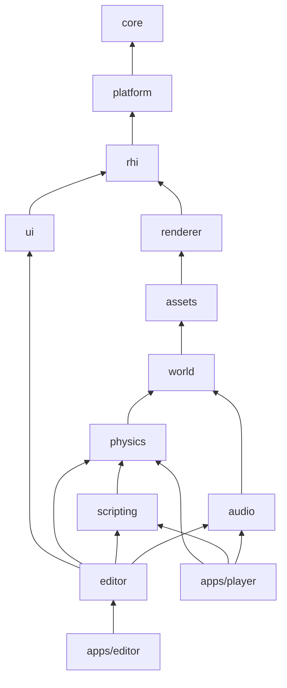

# Sonnet

Sonnet is a 3D game engine written in C++23 for Windows, Linux, macOS, Android and iOS. It is a set of small modules with one-way dependencies, a Vulkan 1.4 renderer behind a thin render-hardware interface, and an editor for authoring, debugging and playing scenes.

**Status: pre-alpha, milestone M5 (audio and animation) landed: build, `core`, `platform`, `rhi` with a bindless set, `renderer` with a clustered forward pipeline, PBR, cascaded shadows, image-based lighting, post-processing and GPU skinning, `assets` with glTF and image import, skins, clips and sounds, KTX2 cooking and hot reload, `world` on flecs with scenes, prefabs, a fixed timestep and skeletal animation, `physics` on Jolt, Lua `scripting` with hot reload, `audio` on miniaudio, `ui` and an `editor` that authors scenes, materials and scripts with a hierarchy, an inspector, an asset browser, gizmos, picking, undo, play mode and shader hot reload, on a sample project.** This file and [docs/](docs/) describe what is being built and which decisions are already taken. [docs/roadmap.md](docs/roadmap.md) gives the order.

## Goals

- **Personal engine, third iteration.** Learning and clarity of architecture come before feature count. Most decisions below come from what worked and what hurt in the two previous iterations.
- **Modular.** Every module has one job, a public header set under `sonnet/<module>/`, its own tests, and depends only on modules earlier in the dependency order. No cycles.
- **Agnostic where it pays off.** Platform access (window, input, main loop, file paths) and GPU access sit behind interfaces owned by the engine, each with exactly one implementation today: SDL3 and Vulkan. Everything else is a fixed choice: C++23, CMake, GLM, flecs, Slang, Dear ImGui.
- **Modern Vulkan only.** One rendering code path on Vulkan 1.4: dynamic rendering, synchronization2, bindless descriptors, push descriptors. No legacy render passes and no second backend to keep in parity.
- **Editor first.** The editor is an engine feature, not a demo. It drives the design of reflection, serialization, undo/redo and play mode.
- **Exportable.** A game is a project folder (scenes, assets, scripts) run by a generic player binary, so exporting never needs a compiler on the target.
- **Measurable performance.** Proposed targets: 10 000 visible draws and 100 dynamic lights at 1080p in 16.6 ms on a 2020-era mid-range desktop GPU, and the same scene in 33 ms on a 2022 flagship phone. First measured in M3 on an RTX 4090 ([docs/roadmap.md](docs/roadmap.md#m3-assets-and-pbr)): about 1.1 ms of GPU time and, until draws go GPU-driven, far more CPU time.

## Non-goals (for now)

- 2D-specific tooling, networking, consoles, other graphics backends (OpenGL, Direct3D, native Metal), managed scripting languages.
- A general-purpose framework. Only what the editor and the sample games need gets built.

## Planned features

| Feature | Milestone |
|---|---|
| Editor shell: docking layout, scene viewport, fly camera, frame statistics overlay | M1 |
| Editor: scene hierarchy, object inspector, gizmos, picking, undo/redo, play/stop | M2 |
| Editor: asset browser, material editing | M3 |
| On-screen performance and resource monitoring, Tracy profiling | M0 (Tracy), M1 (overlay) |
| Physically based rendering, shadows, image-based lighting, post-processing | M3 |
| Physics (Jolt) and Lua scripting | M4 |
| Audio and skeletal animation | M5 |
| Player binary and export to Windows, Linux and macOS | M6 |
| Export to Android and iOS | M7 |

## Platforms

| Platform | Editor | Player | Vulkan 1.4 comes from |
|---|---|---|---|
| Windows 10/11 x64 | yes | yes | GPU vendor drivers |
| Linux x64 | yes | yes | Mesa (RADV, ANV, Lavapipe) or NVIDIA drivers |
| macOS 12+ (arm64, x64) | yes | yes | MoltenVK 1.4+ over Metal; portability-subset rules apply |
| Android | no | yes | Devices launching with Android 16+, where 1.4 is mandatory. Older devices are not supported. |
| iOS 15+ | no | yes | MoltenVK 1.4+; built from a macOS host |

Vulkan 1.4 is a hard minimum ([ADR-0001](docs/decisions/0001-vulkan-1.4-only.md)). Per-platform consequences are in [docs/rendering.md](docs/rendering.md#platform-notes).

## Technology

| Library | Purpose | Source |
|---|---|---|
| C++23, CMake 3.28+ | Language and build | Toolchain |
| [SDL3](https://libsdl.org) | Window, input, main-loop callbacks, audio device, file paths | vcpkg `sdl3` |
| Vulkan 1.4 + Vulkan-HPP (RAII) | GPU API | vcpkg `vulkan-headers`, `vulkan-loader`; Vulkan SDK on dev machines for validation layers |
| [vk-bootstrap](https://github.com/charles-lunarg/vk-bootstrap) | Instance, device and swapchain creation | vcpkg `vk-bootstrap` |
| [Vulkan Memory Allocator](https://github.com/GPUOpen-LibrariesAndSDKs/VulkanMemoryAllocator) (Hpp bindings) | GPU memory allocation, budgets, leak tracking | vcpkg `vulkan-memory-allocator-hpp` |
| [Slang](https://shader-slang.org) | Shading language, compiler, reflection | vcpkg `shader-slang` |
| [GLM](https://github.com/g-truc/glm) | Math | vcpkg `glm` |
| [flecs](https://www.flecs.dev) | Entity component system, hierarchy, prefabs, reflection | vcpkg `flecs` ([ADR-0003](docs/decisions/0003-ecs-library.md)) |
| [Dear ImGui](https://github.com/ocornut/imgui) (docking branch) | Editor and debug UI | vcpkg `imgui[docking-experimental,sdl3-binding,vulkan-binding]` |
| [spdlog](https://github.com/gabime/spdlog) | Logging | vcpkg `spdlog` |
| [Tracy](https://github.com/wolfpld/tracy) | CPU/GPU profiling | vcpkg `tracy` |
| [nlohmann-json](https://github.com/nlohmann/json) | Project and scene files | vcpkg `nlohmann-json` |
| [fastgltf](https://github.com/spnda/fastgltf) | glTF 2.0 import | vcpkg `fastgltf` |
| [stb](https://github.com/nothings/stb) | Image decoding for import | vcpkg `stb` |
| [KTX-Software](https://github.com/KhronosGroup/KTX-Software) | KTX2 / Basis Universal GPU-compressed textures | vcpkg `ktx` |
| [Catch2](https://github.com/catchorg/Catch2) | Unit tests | vcpkg `catch2` |
| [Jolt Physics](https://github.com/jrouwe/JoltPhysics), Lua + [sol2](https://github.com/ThePhD/sol2), [miniaudio](https://miniaud.io) | Physics, scripting, audio (M4, M5) | vcpkg `joltphysics`, `lua`, `sol2`, `miniaudio` |

Dependency policy: vcpkg manifest mode for everything that has a port; CMake `FetchContent` only for libraries without a port or for pinned forks carrying local patches; never both for the same library ([ADR-0004](docs/decisions/0004-vcpkg-first.md)).

## Architecture

A module depends only on modules earlier in the dependency order. Interfaces live with the layer that owns them, next to their default implementation. Upward communication happens through those interfaces, callbacks and events, never through a dependency.



| Module | Responsibility |
|---|---|
| `core` | Types, typed handles, logging, assertions, UUIDs, hashing, GLM configuration |
| `platform` | Window, input events, main-loop callbacks, file paths. Interface plus the SDL3 implementation |
| `rhi` | Render hardware interface plus the Vulkan 1.4 implementation |
| `renderer` | Render graph, materials, meshes, cameras, lights, passes. Talks only to `rhi` interfaces |
| `assets` | Asset database, importers, cooking, hot reload |
| `world` | ECS world, core components (Transform, hierarchy, Name), scene load and save, skeletal animation |
| `physics` | Rigid bodies, colliders and raycasts behind `IPhysicsWorld`, on Jolt |
| `scripting` | Lua scripts on entities behind `IScriptRuntime`, reaching components through reflection |
| `audio` | Sounds on entities behind `IAudioDevice`, on miniaudio |
| `ui` | Dear ImGui layer. Editor and debug builds only |
| `editor` | Panels, selection, undo/redo, gizmos, play mode. Desktop only |

Details, including the entity model, resource handles and the editor/player split, are in [docs/architecture.md](docs/architecture.md).

## Repository layout

```
sonnet/
├── CMakeLists.txt, CMakePresets.json, vcpkg.json, vcpkg-configuration.json
├── cmake/                 — options, module and test helpers, toolchain glue
├── ports/                 — vcpkg overlay ports carrying local patches
├── modules/<name>/        — include/sonnet/<name>/, src/, tests/, shaders/ (renderer only)
├── apps/
│   ├── editor/            — the editor executable (desktop)
│   ├── cook/              — sonnet_cook, which cooks a project into a bundle
│   ├── player/            — the generic runtime that exported projects run on
│   └── samples/           — sample projects used for testing and demos
├── docs/                  — this documentation, decisions/ for ADRs
└── .github/workflows/     — CI
```

## Building

Prerequisites: a C++23 compiler, CMake 3.28+, Ninja and vcpkg with `VCPKG_ROOT` set. Details, presets and options are in [docs/build.md](docs/build.md).

```bash
export VCPKG_ROOT=/path/to/vcpkg
cmake --preset linux-debug          # or windows-debug, macos-debug
cmake --build --preset linux-debug
ctest --preset linux-debug
```

## Documentation

| Topic | Document |
|---|---|
| Architecture: modules, dependency rule, entity model, handles, editor/player | [docs/architecture.md](docs/architecture.md) |
| `core`: handles, logging, assertions, errors, UUIDs | [docs/core.md](docs/core.md) |
| `platform`: window, events, application lifecycle, paths | [docs/platform.md](docs/platform.md) |
| Build system, toolchains, dependencies, CI | [docs/build.md](docs/build.md) |
| Rendering: Vulkan baseline, platform notes, Slang pipeline, frame structure, render graph | [docs/rendering.md](docs/rendering.md) |
| Editor: the Dear ImGui layer, panels, viewport camera, frame order | [docs/editor.md](docs/editor.md) |
| Assets: identity, database, importers, project and scene files, cooking | [docs/assets.md](docs/assets.md) |
| World: components, phases and the fixed timestep, animation, scenes and prefabs | [docs/world.md](docs/world.md) |
| Physics: bodies, colliders, the simulation, queries | [docs/physics.md](docs/physics.md) |
| Scripting: script instances, errors and hot reload, the Lua API | [docs/scripting.md](docs/scripting.md) |
| Audio: sources and listeners, playing, miniaudio | [docs/audio.md](docs/audio.md) |
| Roadmap and milestones | [docs/roadmap.md](docs/roadmap.md) |
| Conventions: code style, math, error handling, logging, commits, versioning | [docs/conventions.md](docs/conventions.md) |
| Decision records | [docs/decisions/](docs/decisions/) |

## Decisions

| ADR | Decision | Status |
|---|---|---|
| [0001](docs/decisions/0001-vulkan-1.4-only.md) | Vulkan 1.4 is the only graphics backend and a hard minimum | Accepted |
| [0002](docs/decisions/0002-sdl3-over-glfw.md) | SDL3 for windowing, input and the main loop | Accepted |
| [0003](docs/decisions/0003-ecs-library.md) | flecs as the entity component system | Accepted, EnTT recorded as the alternative |
| [0004](docs/decisions/0004-vcpkg-first.md) | vcpkg first, FetchContent for edge cases | Accepted |
| [0005](docs/decisions/0005-slang.md) | Slang as the only shading language | Accepted |
| [0006](docs/decisions/0006-vulkan-object-ownership.md) | vk-bootstrap creates, Vulkan-HPP RAII owns | Accepted |
| [0007](docs/decisions/0007-data-driven-game-structure.md) | Games are data-driven projects run by a generic player | Accepted |
| [0008](docs/decisions/0008-clustered-forward-rendering.md) | Clustered forward rendering as the main pipeline | Accepted |
| [0009](docs/decisions/0009-physics-and-scripting.md) | Physics and scripting as world subsystems | Accepted |
| [0010](docs/decisions/0010-audio-and-animation.md) | Audio on miniaudio, animation in `world`, skinning in compute | Accepted |
| [0011](docs/decisions/0011-cooked-bundles-and-the-player.md) | Cooked bundles, the `runtime` module and what export assembles | Accepted |

## License

No license has been chosen yet. Until one is added, all rights are reserved.
