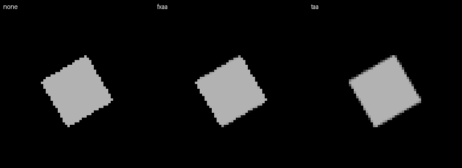
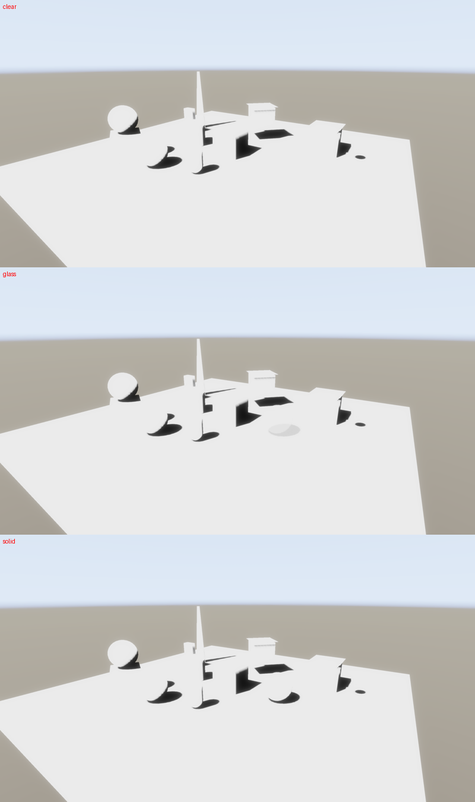
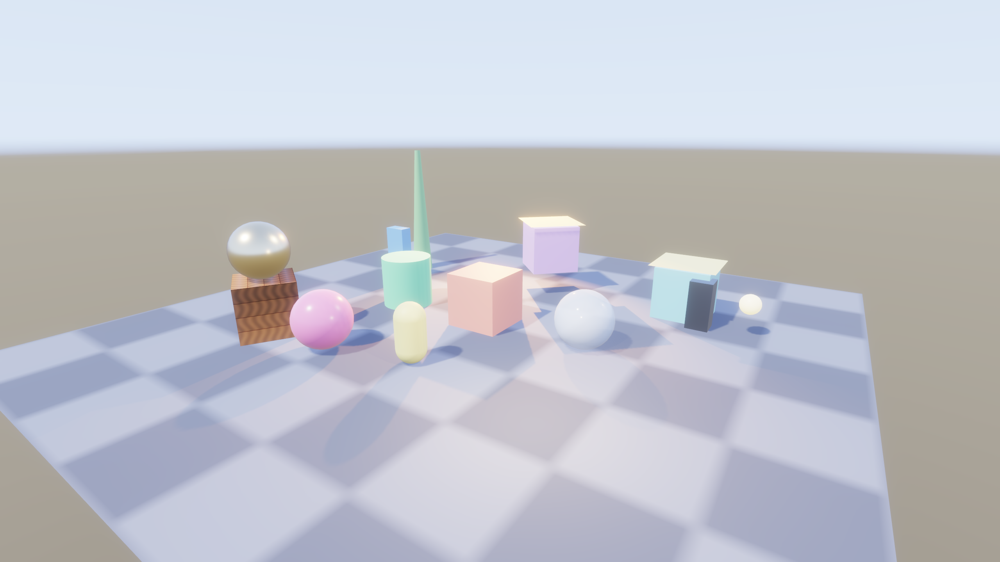

# M13 macOS GPU validation

Fresh validation of [issue 139](https://github.com/Pacheco95/sonnet/issues/139)
at `d07d3a1`, on 2026-10-09. Report only; no engine or sample changes.
Rendering correctness passed. The unresolved Debug timing discrepancy has its
own [follow-up, issue 141](https://github.com/Pacheco95/sonnet/issues/141).

## Setup

Apple M4-generation GPU, arm64 macOS, Apple Clang 17. Tests load the SDK's
MoltenVK 1.4.1 (device Vulkan 1.4.334, loader 1.4.341). Debug requests Khronos
validation, including synchronization validation; Release disables it.
The local presets select the Xcode compiler recommended by this checkout.
Release explicitly overrides the local preset's default RelWithDebInfo:

```sh
cmake --preset macos-release-local -DCMAKE_BUILD_TYPE=Release
cmake --build --preset macos-release-local --target rhi_tests renderer_tests assets_tests sonnet_player_app sonnet_cook_app
cmake --preset macos-debug-local
cmake --build --preset macos-debug-local --target rhi_tests renderer_tests assets_tests sonnet_player_app
```

For tests, point `SDL_VULKAN_LIBRARY` at the SDK loader, `VK_DRIVER_FILES` at
its MoltenVK manifest, and `VK_ADD_LAYER_PATH` at its explicit layer directory.
Run with access to Metal devices. The player instead uses its statically linked
MoltenVK 1.4.2 (Vulkan and reported loader 1.4.357); unset the first two variables
for that path. KTX-Software is the overlay's 5.0.0-rc2.

## Correctness

Both configurations passed with **no skipped cases**:

| Command, binary under the configuration's module directory | Release | Debug with validation |
|---|---:|---:|
| `rhi_tests` | 4,611 assertions, 48 cases | 4,611 assertions, 48 cases |
| `renderer_tests '[gpu]~[benchmark]'` | 16,754 assertions, 35 cases | 16,754 assertions, 35 cases |
| `assets_tests '[hdr]'` | 39 assertions, 2 cases | 39 assertions, 2 cases |

The renderer's hidden benchmarks were run separately in Release:
`SONNET_BENCH_AA=none|fxaa|taa renderer_tests '[benchmark]'`, one invocation per
mode, each passing 22 assertions in three cases (draws, particles, multiview).
The AA environment variable changes the draws benchmark; the other two retain
their own settings. Thus all `[gpu]` cases were covered in Release, with Debug
correctness and the draws benchmark also checked.

The device line reports **BC, ASTC, ASTC HDR**. `bc6hSupported=true` follows BC
support in `VulkanDevice`, and `astcHdrSupported=true` is the ASTC HDR flag.
Both RHI HDR format tests ran: BC6H and ASTC HDR upload, mip sampling and pixel
checks. `readKtx2` prefers **BC6H** when both are available. The asset GPU test
compares the original environment with native transcoding and RGBA16F fallback,
checking sky, diffuse irradiance and prefiltered reflections against a control.

Motion attachment values, skinned motion, TAA convergence, the moving bright
box's trail, independent view histories and conservative two-phase occlusion
passed. For all three AA modes, an additional temporary Debug harness reused
`GpuScene` and the existing still-scene and moving-box tests: select None, FXAA
or TAA in `taaSettings`, keep the stability and trail thresholds, and require an
edge difference from the unresolved reference only for FXAA and TAA. All
**194 assertions in six cases** passed with validation enabled. Each mode
rendered 24 still frames and five moving frames after ten stationary frames.
These bounded scenes establish the tested behavior, not arbitrary-content
freedom from ghosting. The still-frame readbacks show the expected edges:



## Shadows and cooked environment

The blended-wall GPU test reports average shadowed-ground brightness for alpha
0 / 0.25 / 0.5 / 0.75 / 1 of **218 / 205.922 / 184.938 / 140.875 / 32**, with
lit ground at 218. Darkness increases with alpha; alpha one equals the opaque
control.

For the actual player, copy the basic project to a temporary directory, leaving
the tracked sample unchanged. Make three copies of `main.scene.json`, assigning
`Sphere` a material with `alphaMode="Blend"`, base color `[0.8,0.9,1,alpha]`,
metallic 0, roughness 0.1, no textures and white entity tint. Give each material
its own UUID sidecar and use alpha 0, 0.5 and 1. Cook all scenes for macOS:

```sh
sonnet_cook <temporary-project> --platform macos --out <temporary-cook>
sonnet_player <temporary-cook>/game.sbundle --scene scenes/glass.scene.json --settle-frames 24 --screenshot cooked-final.png
sonnet_player <temporary-project> --scene scenes/glass.scene.json --settle-frames 24 --screenshot source-final.png
sonnet_player <temporary-cook>/game.sbundle --scene scenes/glass.scene.json --settle-frames 24 --shading-term shadow-factor --screenshot glass-shadow.png
```

Repeat the shadow capture for `clear.scene.json` and `solid.scene.json`. All five
native player runs exited 0 with `exit ok`. By eye the half-alpha sphere casts
a partial shadow between the two controls. A 15×14-pixel ground region at
`(1575,889)` inclusive through `(1590,903)` exclusive in the full 2560×1440 captures has mean RGB
brightness **235 / 213.743 / 69.333** for clear / glass / solid:



The cooked scene's sky, diffuse lighting and reflections look correct. Against
the source capture, mean absolute differences per RGB channel are
**0.090 / 0.081 / 0.056** levels of 255, with maxima **8 / 10 / 8**. This
whole-scene comparison also includes cooked LDR textures and meshes; it is not
an isolated HDR codec measurement. The GPU asset test isolates that path.



The [full source capture](macos-m13/source-final.png) is retained for comparison.

## Release wall-clock comparison

Three sequential invocations per AA mode, interleaved None, FXAA, TAA each round.
No Sonnet GPU run or build overlapped these measurements. Background GPU work,
power state and display topology were not controlled. Each of four cases warms
for 30 frames and times 120 frames submitted back to back, including the final
GPU wait and readback. Default job pool and Tracy settings were retained.
Values are median [minimum, maximum] milliseconds per frame:

```sh
SONNET_BENCH_AA=none renderer_tests 'ten thousand draws and a hundred lights at 1080p'
SONNET_BENCH_AA=fxaa renderer_tests 'ten thousand draws and a hundred lights at 1080p'
SONNET_BENCH_AA=taa renderer_tests 'ten thousand draws and a hundred lights at 1080p'
```

| AA | Culling off, no wall | On, no wall | Off, wall | On, wall |
|---|---:|---:|---:|---:|
| None | 2.395 [2.386, 2.405] | 2.529 [2.520, 2.536] | 1.520 [1.519, 1.528] | 1.339 [1.336, 1.341] |
| FXAA | 2.421 [2.420, 2.426] | 2.558 [2.542, 2.562] | 1.554 [1.552, 1.563] | 1.360 [1.358, 1.360] |
| TAA | 2.632 [2.628, 2.640] | 2.772 [2.760, 2.779] | 1.735 [1.734, 1.738] | 1.537 [1.534, 1.543] |

All nine invocations passed 16 assertions each. With no AA, culling changes the
medians by **+5.6% without the wall and -11.9% with it**, consistent with the
earlier Release observation. With default TAA, the changes are +5.3% and -11.4%.
TAA adds 0.20–0.24 ms over None in these scenes. These are three-run wall-clock
comparisons, not isolated pass costs or general performance guarantees.

## Debug discrepancy

The earlier Debug per-pass inflation remains. The same draws benchmark passed
16 assertions with validation on, then again using a temporary copy of the
Debug test source with only `gpuDevice`'s `DeviceDesc::enableValidation=false`.
Libraries, shaders and benchmark workload remained Debug. These are single-run
diagnostics, not the three-run Release medians above:

| Configuration, AA None | Culling off, no wall | On, no wall | Off, wall | On, wall |
|---|---:|---:|---:|---:|
| Release wall clock, first run | 2.395 | 2.529 | 1.519 | 1.341 |
| Release GPU timestamp sum | 2.327 | 2.437 | 1.461 | 1.283 |
| Debug validation on, wall clock | 27.786 | 27.848 | 27.470 | 27.677 |
| Debug validation on, GPU sum | 2.311 | 5.412 | 1.474 | 5.188 |
| Debug validation off, wall clock | 26.914 | 26.908 | 26.634 | 27.059 |
| Debug validation off, GPU sum | 2.292 | 3.841 | 1.463 | 5.374 |

Disabling validation does not remove the effect, ruling it out as the sole
cause. No GPU regression is established by these values: MoltenVK's emulated
timestamps and Debug CPU submission gaps remain hypotheses. Diagnosis and any
necessary correction continue in [issue 141](https://github.com/Pacheco95/sonnet/issues/141).
Use Release wall clock for the performance conclusion.

## Warnings

The validated SDK test runs produced no counted Vulkan validation messages.
Their RHI stale-handle/storage-view warnings come from intentional negative
tests; the renderer prints its shadow measurements through Catch2 `WARN`.
The normal player emits the known `R32Uint` blend warning
([issue 59](https://github.com/Pacheco95/sonnet/issues/59)). Its static MoltenVK
path cannot load the SDK validation layer, so Debug also logs the expected
validation-unavailable notice. No other driver warning or error occurred.

An initial player capture forced the SDK loader despite the player's static
MoltenVK and emitted an Objective-C duplicate-class diagnostic. Repeating with
the documented native path removed it. Only those repeated native captures are
included here; SDK tests, which do not statically link MoltenVK, retain layers.
